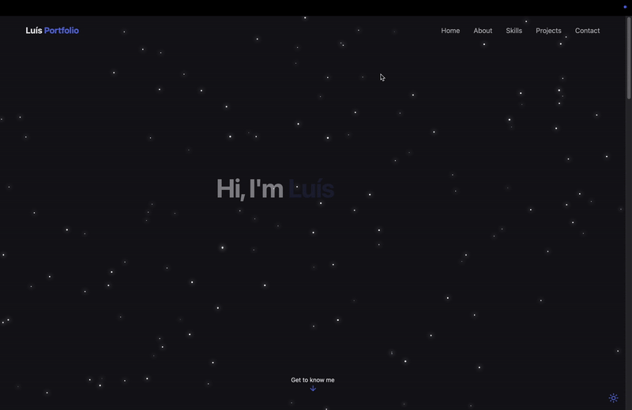

# 🌐 Portfolio Website

Welcome to my personal **portfolio website**! 
This project showcases who I am, what I build, and how I approach software development.



---

## 🚀 Tech Stack


---

## 💡 Features

- 🎨 **Modern and responsive UI**
  - Built entirely with TailwindCSS and custom animations.
- 🌗 **Light/Dark mode toggle**
  - Theme preference saved in `localStorage`.
- ⭐ **Animated star background**
  - Procedurally generated and responsive to window size.
- 🧭 **Smooth navigation**
  - Mobile-friendly navbar and scroll-to-section transitions.
- 💼 **Projects showcase**
  - Highlighted with tags, preview GIFs, and GitHub links.
- 🧠 **Dynamic filtering**
  - Filter technical skills by category.
- 📬 **Contact section**
  - Direct links to email, LinkedIn, and GitHub.

---

## 🧱 Project Structure
```
src/
├── components/ # Reusable UI sections (Hero, About, Projects, etc.)
├── pages/ # Page-level routes
├── assets/ # Icons, logos, and images
├── lib/ # Helper utilities
├── index.css # Tailwind + custom utilities
└── main.jsx # React entry point
```

---

## 🛠️ Setup & Development

### 1️⃣ Install dependencies
```bash
npm install
```

### 2️⃣ Run development server
```bash
npm run dev
```

---

## 📸 Sections Overview

| Section | Description|
| - | - |
| Hero | Intro banner with animated greeting |
| About | Personal background and key soft skills |
| Skills | nteractive filterable skill grid |
| Projects | Gallery of key development projects |
| Contact | Email, LinkedIn, and GitHub links |
| Footer | Simple responsive footer |

---

### 👋 Thanks for Visiting

Thanks for checking out my portfolio!  
This project was my **first real approach with React**, and it taught me a lot about building modern web interfaces, components, and state handling.  
I’m still learning and improving every day, and this site will keep evolving as I do.  

I’m always open to feedback, collaboration, or just a chat about cool projects.  

Feel free to reach out through [LinkedIn](https://linkedin.com/in/luisfbneves) or [GitHub](https://github.com/luisneves10).


